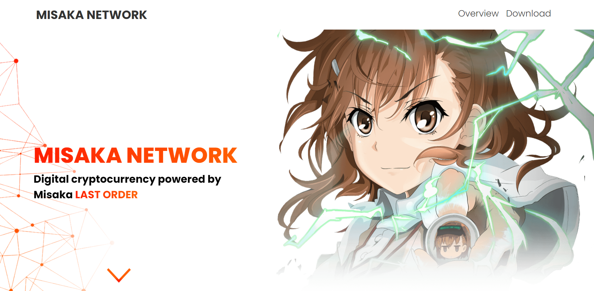

<h1>Misaka Network</h1>
<h2>Taks Overview</h2>

The client with whom I worked with had created a blockchain mining and
wallet application and desired to represent his work in a way that would honor one of his favorite anime character.

 

 
<h2>Design</h2>

The design is inspired by the current trend of minimalism. The color white was used (by default) to fill out empty space with the main colors being:

<ul>
    <li>Red (#FE1C01)</li>
    <li>Orange (#FF5F01)</li>
    <li>Gray (#333)</li>
</ul>

The images that were used in this project were taken from the internet and modifed in a way that they do not infringe on copyright laws.

<h2>Technologies</h2>

For this project the following tecnologies were used:

<ul>
    <li>
HTML - Used to create the markup of the page.

    </li>
        <li>
SASS/CSS - Sass was used in order to streamline and simplify the styling of the page.

    </li>
        </li>
        <li>
ReactJS - This framework was useful to more easily create sections and components of the website.

    </li>

</ul>